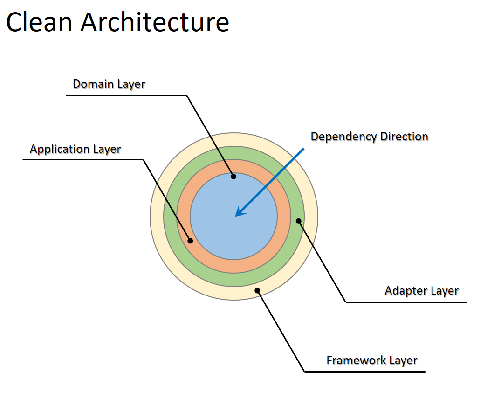
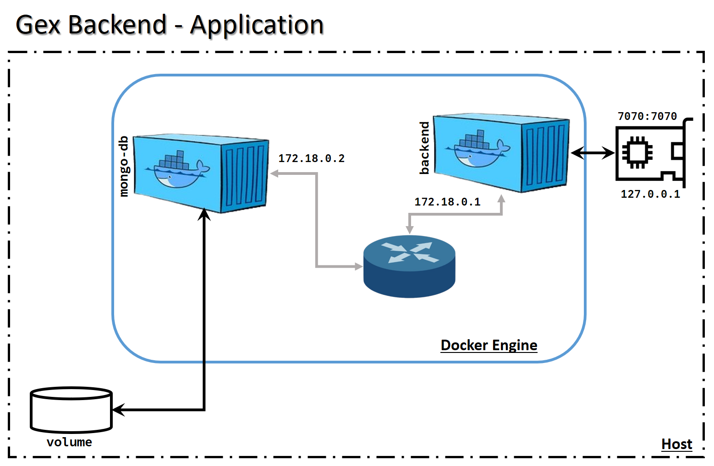
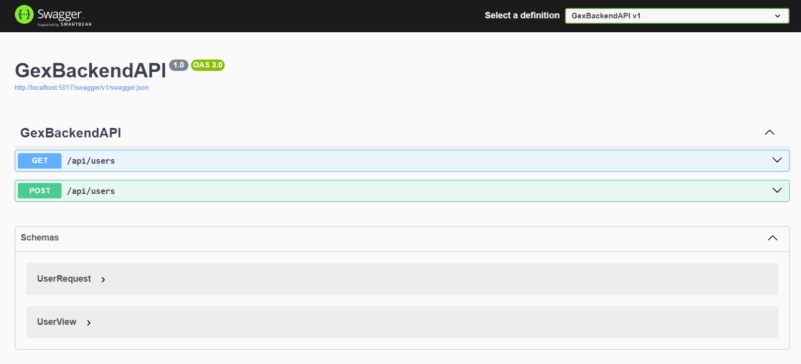
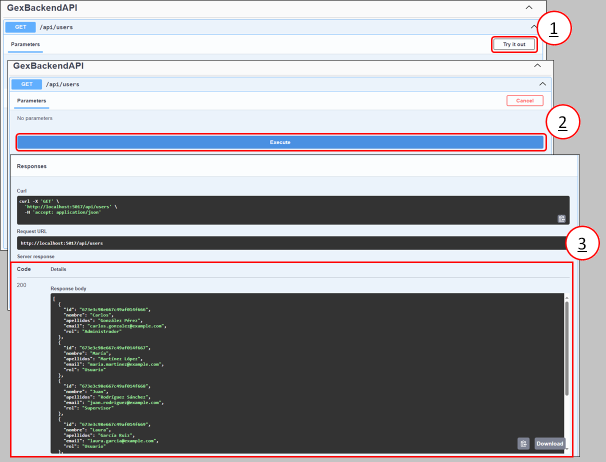

# _Gex Backend .Net_

### _This is a proposal for a Backend application for managing prucurement electronic files which supports the goals of the `"Administracion General del Estado y sus Organismos Autonomos"` to encompass all the information and documentation in a unified manner_

## `Requirements`

- .Net 8.0
- MongoDB.Driver
- ASP.Net
- Docker

## `Software Architecture`

The application is developed based on a **_Clean Architucture_** pattern which helps to split the different concers and/or responsabilities in specific layers with the main objective to isolate the domain rules from any details that are not related.

The use of thise architecture, it also improves testability and simplifies changes which improves maintainability.

<p align="center">

<br>
<i>Gex Backend Application - Software Layers Implemented</i>
</p>
<br>

The backend application implements 4 layers:

- **Domain Layer:** Implements the business rules of the application.
- **Application Layer:** Implements the use cases of the application.
- **Adapter Layer:** Implements the interfaces with external systems to support data transformation to be consumed by the application and external systems.
- **Framework Layer:** This layer allows to expose the application throughout a standard interface such as REST-API. The framework ASP.Net is used for this purpose.

## `How to Run the Application`

To simplify this process avoiding the setup of a local environment, the application has been _containerized_.

<p align="center">

<br>
<i>Gex Backend - Containerized</i>
</p>
<br>

### `Installation`

1. Clone the repository or download the code in a local folder.
2. Open a terminal and navigate inside the local folder where the code resides.  
   **_NB: For the next steps it is required that Docker or Docker Desktop is installed in your local system_**
3. Create a docker image using the `Dockerfile` provided runing the next command.

```bash
docker build . --tag gex-backend:0.0.1
```

4. Download the mongo-db image from Docker Hub running the next command.

```bash
docker pull mongo:8.0.3
```

5. Verify that both images appear in the local resgistry running the next command.

```bash
docker image ls
```

### `Running the Application`

A `docker-compose.yaml` is used to launch the application. From the terminal, and being sure you are in the local folder where the code resides, run the next command.

```bash
docker compose up -d
```

### `Testing the Application`

The application expose a _Swagger Interface_ which is accessed thru the next _URL_.

```bash
http://localhost:7070/swagger
```

<p align="center">

<br>
<i>Gex Backend - Swagger</i>
</p>
<br>

The interface is displayed typing the _URL_ on any web browser. The interface shows all the API endpoints and those can be tested using the next procedure.

<p align="center">

<br>
<i>Swagger Operation</i>
</p>
<br>

1. Expand the _action_ that you want to perform, and click on the **_"Try it out"_** button.
2. The interface will show the command button to **Execute** the operation. _Be aware that maybe more information should be provided to execute the operation._
3. Verify the results of the operation.
